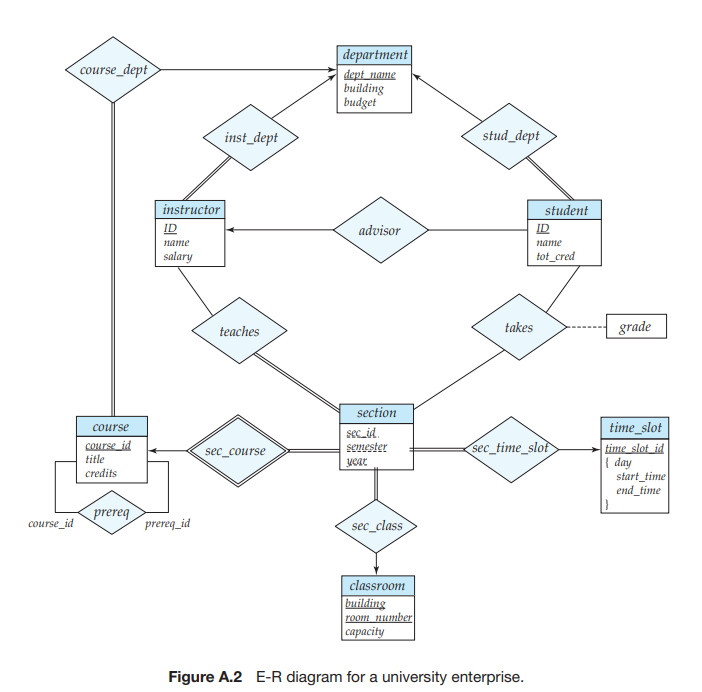
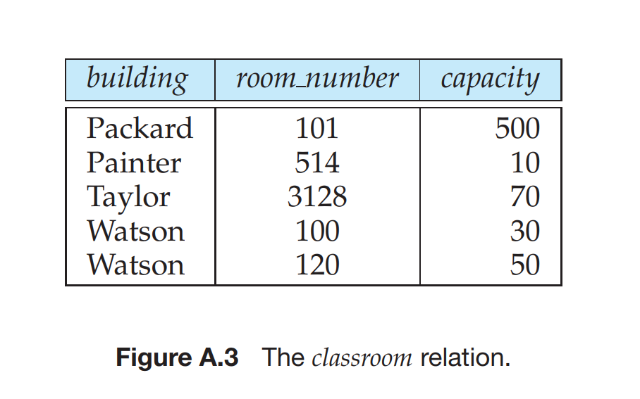
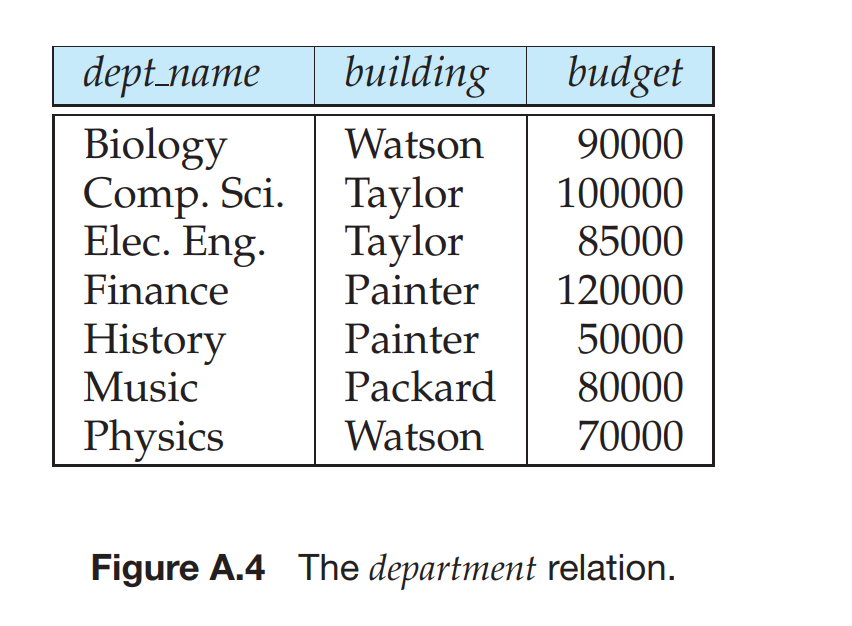
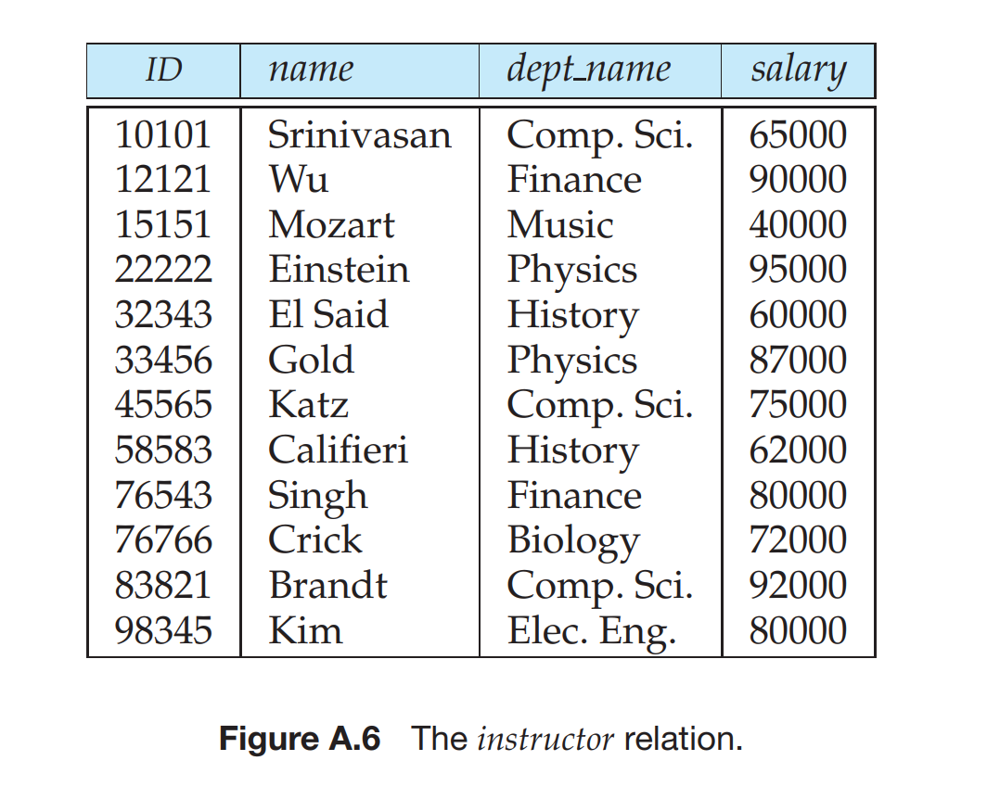
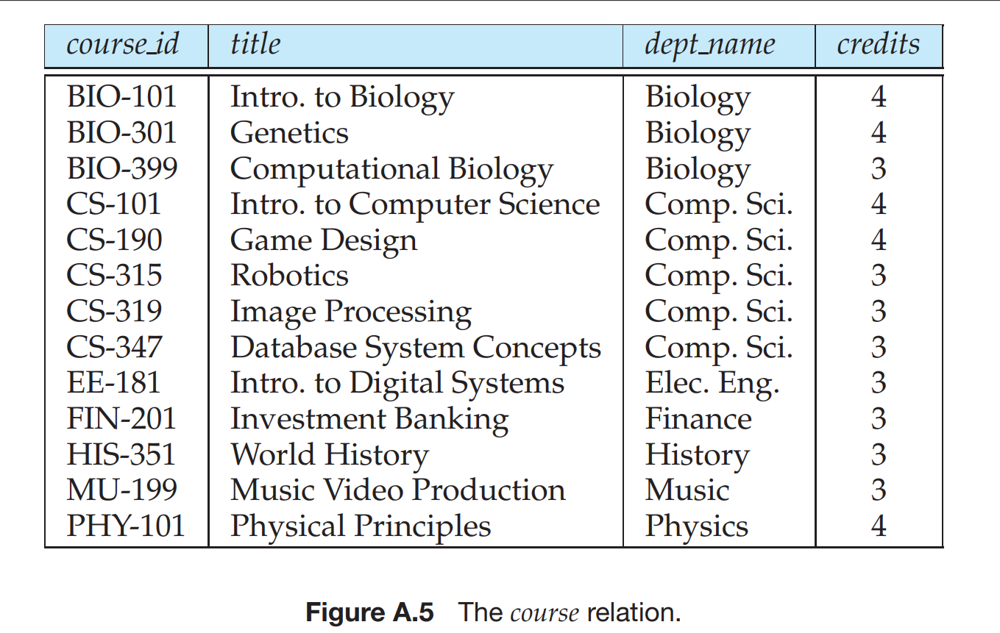
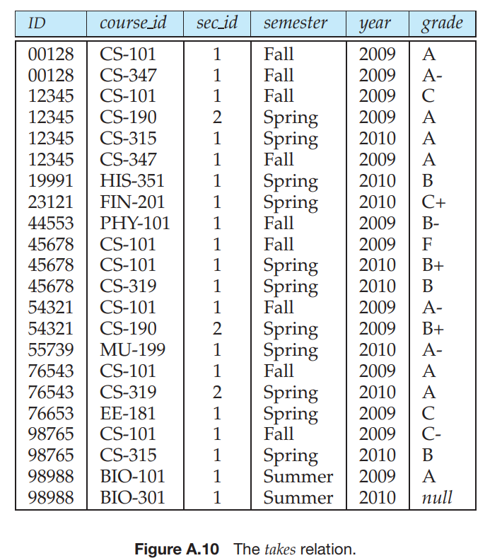
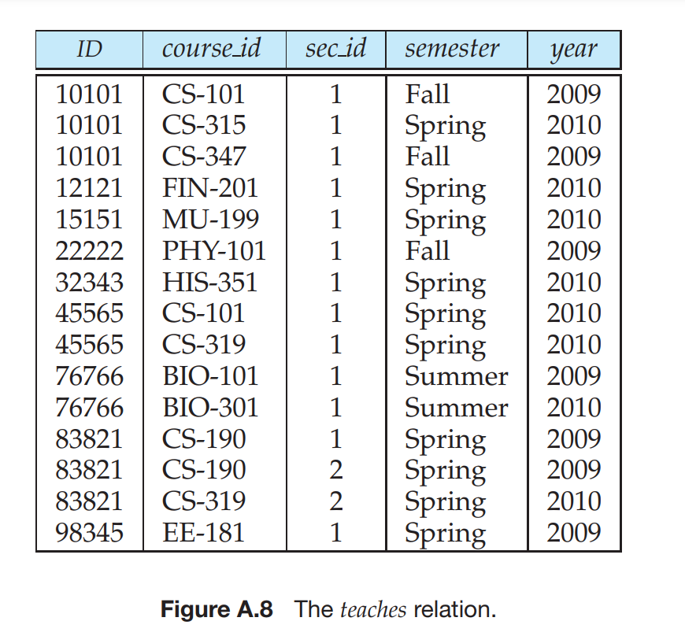
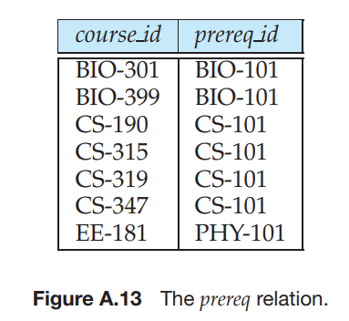
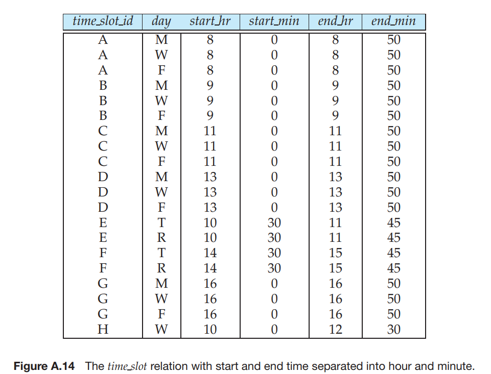

# University Database


## Table of Contents

- [Introduction](#introduction)
- [Features](#features)
- [Getting Started](#getting-started)
  - [Prerequisites](#prerequisites)
  - [Installation](#installation)
- [Schema](#schema)

## Introduction

The University Database is a comprehensive system designed to manage and organize various aspects of our university's data. This README provides an overview of the database, its features, and how to get started with it.

## Features

- Student information management
- Course registration and enrollment
- Faculty and staff records
- Academic program tracking
- Grades and transcript management
- User authentication and access control
- Reporting and analytics

## Getting Started

### Prerequisites

Before you can use the University Database, ensure you have the following software installed:

- [Database Management System (e.g., MySQL, PostgreSQL)](database_link)
- [Python 3](https://www.python.org/downloads/)
- [Git](https://git-scm.com/downloads)

### Installation

1. Clone this repository to your local machine using Git:

   ```bash
   git clone https://github.com/JagrutThakare/University-DB

   
## Schema


# The Database has following tables : 
 


 






# You can run SQL commands in University.sql file to see the database. Just type "source path/University.sql" in mysql workbench or cmd and your DB will ready.
