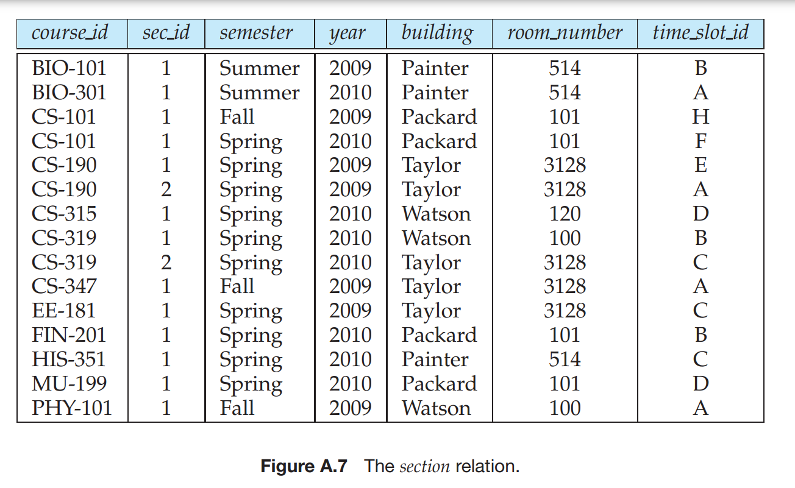

<header class="flex jc-sb ai-c" data-v-b5bf92e0=""><nav class="flex jc-fe ai-c" data-v-b5bf92e0=""><a href="https://orb.riseintime.com/" target="_blank" data-v-b5bf92e0="">Wiki</a></nav><a href="https://discord.gg/WWTRgBG" target="_blank" data-v-b5bf92e0="">
Join Discord
</a></header>
# University-DB

## Schema : 

# The Database has following tables : 
 

 

# You can run SQL commands in University.sql file to see the database.
