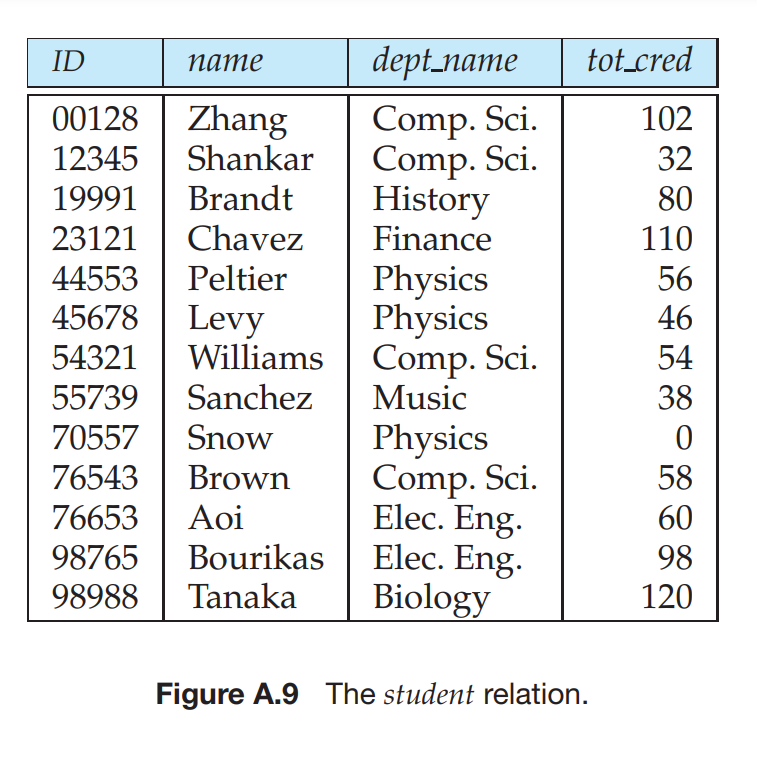

 
<h1 align="center"> University Database </h1>

## Table of Contents

- [Introduction](#introduction)
- [Features](#features)
- [Getting Started](#getting-started)
  - [Prerequisites](#prerequisites)
  - [Installation](#installation)
- [Schema](#schema)
- [Sample](#sample)

## Introduction

The University Database is a comprehensive system designed to manage and organize various aspects of our university's data. This README provides an overview of the database, its features, and how to get started with it.

| Table       | Number of Records |
|-------------|-------------------|
| Department  | 20                |
| Instructor  | 50                |
| Student     | 2,000             |
| Course      | 200               |
| Prerequisite| 100               |
| Section     | 100               |
| Time Slot   | 20                |
| Teaches     | 100               |
| Takes       | 30,000            |
| Advisor     | 2,000             |


## Features

- Student information management
- Course registration and enrollment
- Faculty and staff records
- Academic program tracking
- Grades and transcript management
- User authentication and access control
- Reporting and analytics

## Getting Started

### Prerequisites

Before you can use the University Database, ensure you have the following software installed:

- Database Management System (e.g., MySQL, PostgreSQL)

### Installation

1. Clone this repository to your local machine using Git:

   ```bash
   git clone https://github.com/JagrutThakare/University-DB

   
## Schema


## Sample 
 


 


## You can run SQL commands in University.sql file to see the database. Just type "source path/University.sql" in mysql workbench or cmd and your DB will ready.

